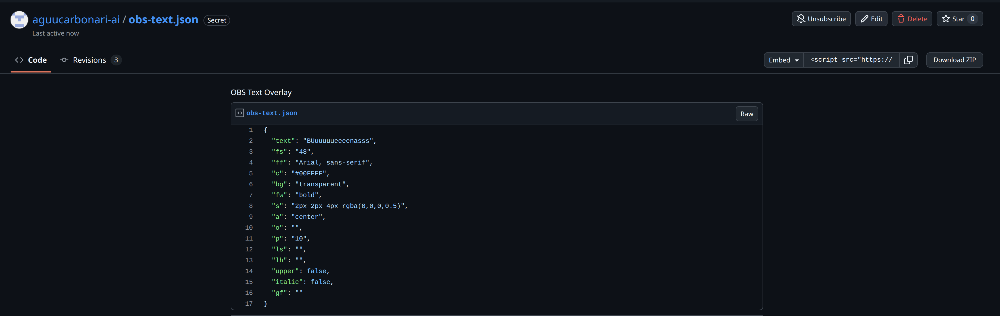
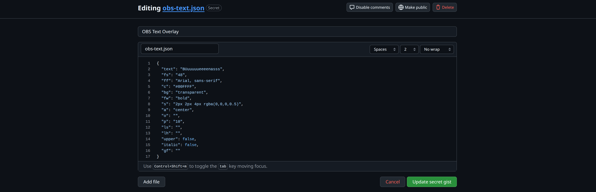

# Trading Widget - OBS Overlays

## obs-text.html - Texto configurable para OBS

Overlay de texto para OBS que se actualiza editando un JSON en GitHub Gist, sin tocar OBS ni hacer redeploy.

### Paso a paso

#### Setup

1. Ya hay un Gist creado: [obs-text.json](https://gist.github.com/aguucarbonari-ai/115beaf8fb18659a9d920ffdbc6d81f0)

2. En OBS, agregar una fuente **Browser** con la URL:
   ```
   https://aguucarbonari-ai.github.io/trading-widget/obs-text.html?gist=115beaf8fb18659a9d920ffdbc6d81f0
   ```

3. Para cambiar texto o estilos:

   **Paso 1:** Ir al [Gist](https://gist.github.com/aguucarbonari-ai/115beaf8fb18659a9d920ffdbc6d81f0) y hacer click en **Edit**:

   

   **Paso 2:** Modificar los valores del JSON (texto, colores, tamaño, etc.) y hacer click en **Update secret gist**:

   

   El overlay en OBS se actualiza solo en ~5 segundos.

#### Formato del JSON

```json
{
  "text": "Hello World",
  "fs": "48",
  "ff": "Arial, sans-serif",
  "c": "#ffffff",
  "bg": "transparent",
  "fw": "bold",
  "s": "2px 2px 4px rgba(0,0,0,0.5)",
  "a": "center",
  "o": "",
  "p": "10",
  "ls": "",
  "lh": "",
  "upper": false,
  "italic": false,
  "gf": ""
}
```

| Campo | Descripción | Valor por defecto |
|-------|-------------|-------------------|
| `text` | Texto a mostrar. Usá `\n` para saltos de línea. | `Hello World` |
| `fs` | Tamaño de fuente en px | `48` |
| `ff` | Familia tipográfica | `Arial, sans-serif` |
| `c` | Color del texto (hex) | `#ffffff` |
| `bg` | Color de fondo (hex o `transparent`) | `transparent` |
| `fw` | Grosor (`normal`, `bold`, `100`-`900`) | `bold` |
| `s` | Sombra (CSS text-shadow) | `2px 2px 4px rgba(0,0,0,0.5)` |
| `a` | Alineación (`left`, `center`, `right`) | `center` |
| `o` | Color de contorno (hex) | - |
| `p` | Padding en px | `10` |
| `ls` | Espaciado entre letras en px | - |
| `lh` | Altura de línea | - |
| `upper` | Mayúsculas (`true`/`false`) | `false` |
| `italic` | Itálica (`true`/`false`) | `false` |
| `gf` | Google Font a cargar | - |

Solo necesitás incluir los campos que querés cambiar. Los que no estén usan el valor por defecto.

#### Parámetros de URL (modo Gist)

| Parámetro | Descripción | Valor por defecto |
|-----------|-------------|-------------------|
| `gist` | ID del GitHub Gist | - (requerido) |
| `gf_name` | Nombre del archivo en el Gist (para multi-archivo) | primer archivo |
| `poll` | Intervalo de polling en segundos | `5` |

## ticker-tape.html - Cinta de cotizaciones

Widget de TradingView con cotizaciones en tiempo real (S&P 500, NASDAQ, BTC, ETH, Gold, etc.) para usar como fuente Browser en OBS.

```
https://aguucarbonari-ai.github.io/trading-widget/ticker-tape.html
```
